<!-- ===== HEADER ===== -->
<div align="center">


<a href="https://urshashi09.github.io/portfolio">
  
</a>

<br/>


<a href="https://www.linkedin.com/in/urshashi-majumder-2239661b9"></a>
<a href="https://urshashi09.github.io/portfolio"></a>

</div>

<br/>

<!-- ===== ABOUT ===== -->


###  About Me

```yaml
name: Urshashi Majumder
education: B.Tech CSE (Artificial Intelligence)
university: Techno India University
focus:
  - Backend Engineering
  - AI / LLM Applications
  - Distributed Systems
  - Data Engineering
philosophy: "Practical architecture, scalability, reliability."
```

I enjoy building systems that stitch together **APIs, databases, caching, messaging,
microservices, RAG pipelines, and AI agents** — and I care most about how those pieces
hold up under real load.

<br clear="right"/>

---

<!-- ===== CURRENTLY BUILDING ===== -->
### 🚀 What I'm Working On

<table>
<tr>
<td width="50%" valign="top">

**⚙️ Backend Engineering**
<br/>Node.js · TypeScript · Python · PostgreSQL · MongoDB · Redis

**🔄 Distributed Systems & Microservices**
<br/>RabbitMQ · Redis · Docker · REST APIs

**🐳 Containerization & Deployment**
<br/>Docker images, CI workflows, cloud deploys

</td>
<td width="50%" valign="top">

**🤖 LLM Applications & AI Agents**
<br/>LangChain · LangGraph · Gemini · Groq · Mistral

**📚 RAG Systems**
<br/>Vector DBs · embeddings · document processing · retrieval

**🧠 AI Developer Tooling**
<br/>Intelligent workflow automation

</td>
</tr>
</table>

---

<!-- ===== TECH STACK ===== -->
### 🛠️ Tech Stack

<details open>
<summary><b>💬 Languages</b></summary>
<br/>
<p>


</p>
</details>

<details open>
<summary><b>🔌 Backend & APIs</b></summary>
<br/>
<p>


</p>
</details>

<details open>
<summary><b>🤖 AI / Machine Learning</b></summary>
<br/>
<p>


</p>
</details>

<details open>
<summary><b>🗄️ Databases & Data</b></summary>
<br/>
<p>


</p>
</details>

<details open>
<summary><b>⚡ DevOps & Tools</b></summary>
<br/>
<p>


</p>
</details>

---


<!-- ===== STATS ===== -->

<!--### 📊 GitHub Stats

<div align="center">




<br/><br/>



<br/>



</div>

--- -->


<!-- ===== SNAKE ===== -->
<div align="center">

### 🐍 Watch My Contributions Get Eaten

<picture>
  <source media="(prefers-color-scheme: dark)" srcset="https://raw.githubusercontent.com/urshashi09/urshashi09/output/github-snake-dark.svg" />
  <source media="(prefers-color-scheme: light)" srcset="https://raw.githubusercontent.com/urshashi09/urshashi09/output/github-snake.svg" />
  
</picture>

</div>

---

<!-- ===== LEARNING ===== -->
### 🌱 Currently Learning

<div align="center">

| | |
|---|---|
| 🏗️ Advanced Backend Engineering | 🧩 System Design & Distributed Systems |
| 🤖 LLM Application Architecture | 🕸️ AI Agents & Agentic Workflows |
| 📚 RAG & Retrieval Systems | 🔀 Data Engineering |
| ☁️ Cloud & Containerized Deployment | 📈 Observability & Scaling |

</div>

---

<!-- ===== INTERESTS ===== -->
### 🎯 Areas of Interest

<div align="center">

`Backend Engineering` · `Distributed Systems` · `AI Engineering` · `LLM Applications`
<br/>
`RAG` · `Microservices` · `Data Engineering` · `System Design`

</div>

---

<!-- ===== QUOTE ===== -->
<div align="center">


</div>

---

<!-- ===== CONNECT ===== -->

📫 Connect With Me

<div align="center">

<a href="https://www.linkedin.com/in/urshashi-majumder-2239661b9">  </a> <a href="https://urshashi09.github.io/portfolio">  </a> <a href="https://www.instagram.com/_beaz__09/">  </a>

<br/><br/>

<i>⭐ Always learning, building, and experimenting with backend systems and AI.</i>


</div>
